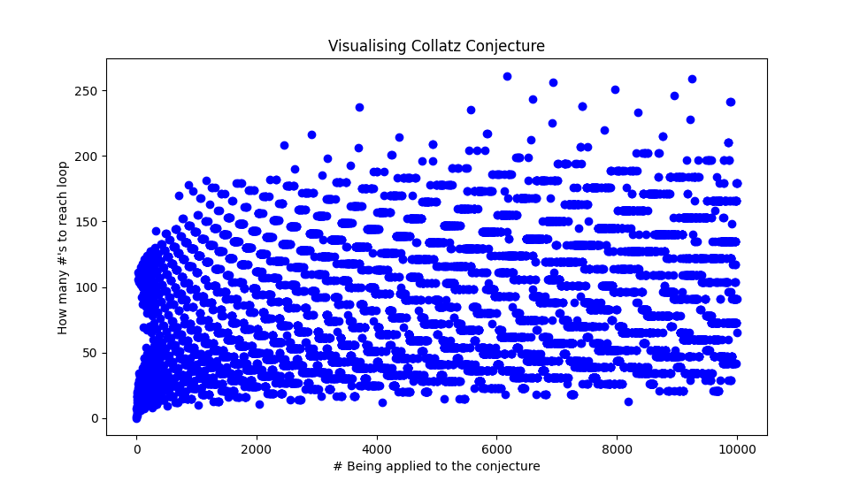

# Visualising Collatz Conjecture
This is a simple visualisation of the Collatz Conjecture Problem.

The conjecture is take a positive integer: 
- If it is an odd number: 
      We multiple by 3 and add 1

- If it is an even number: 
      We divide by 2

We keep applying these rules, until we reach a loop of 4 -> 2 -> 1.

Because every positive number will end up in the 4,2,1 loop. 

I based it off [Veritasium's explanation](https://www.youtube.com/watch?v=094y1Z2wpJg)

So far this is the result I have gotten with 1000:

Increasing the number only follows the same pattern. 

This is just a simple project, in no way I am a expert at math or this conjecture.
I just thought this would be a interesting project.